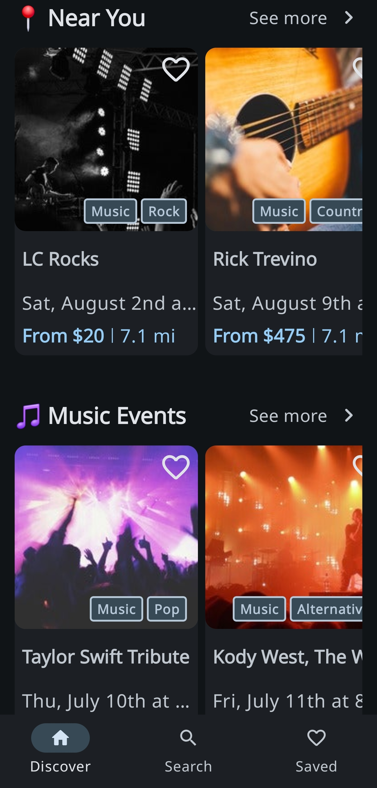
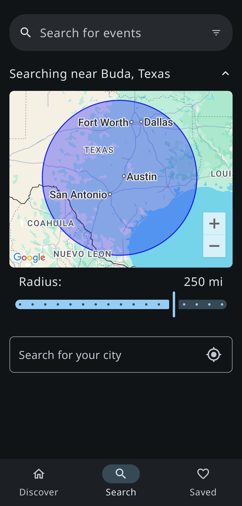
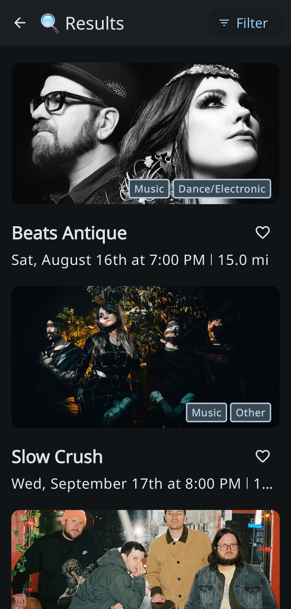
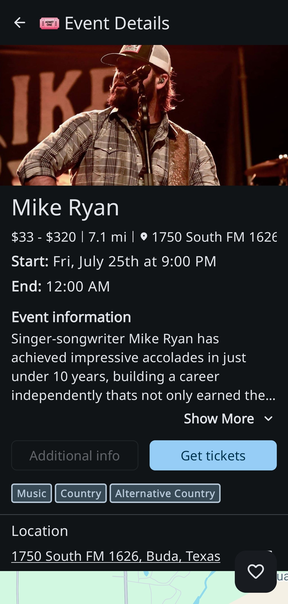
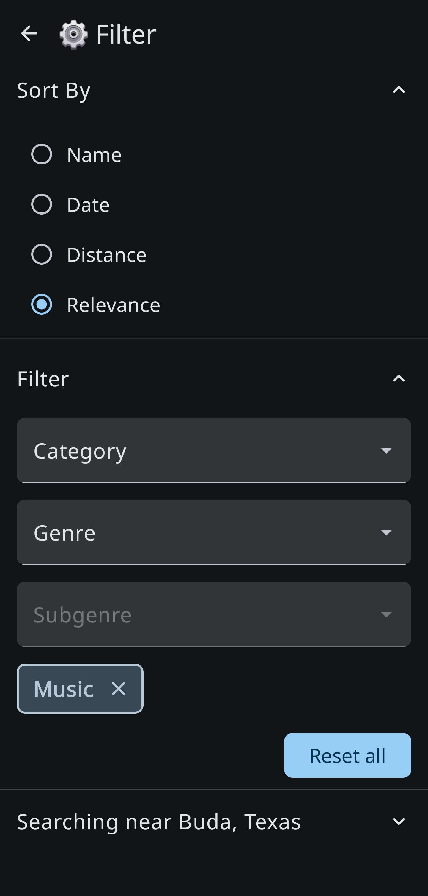

<h1>
  
  LineUp
</h1>

## 🎵 Find Concerts Near You\!

LineUp is a native Android application built with **Kotlin** and **Jetpack Compose**, designed to help you easily discover concerts and events happening in your vicinity. Whether you're looking for a big arena show or a local band at a small venue, Concert Finder aims to connect you with the music you love.

## ✨ Features

  * **Location-Based Search:** Find events near your current location using the Google Geocoding API.
  * **Comprehensive Event Details:** View information about concerts, including date, time, venue, and artists, powered by the Ticketmaster Discovery API.
  * **Save Events Locally:** Store your favorite events for offline access and quick retrieval using **Room Persistence Library**.
  * **Google Maps Integration** View event location info in-app using Google Maps.
  * **User-Friendly Interface:** A modern and intuitive design built with Jetpack Compose.


## 📸 Screenshots

    


## 🚀 Technologies and Architecture

LineUp is built with a focus on modern Android development practices, leveraging the following key technologies and architectural principles:

  * **Kotlin:** The primary programming language for Android development.
  * **Jetpack Compose:** Android's modern toolkit for building native UI.
  * **Retrofit:** A type-safe HTTP client for Android to consume the Ticketmaster Discovery API.
  * **GSON:** Used for serializing and deserializing JSON data from the API responses.
  * **Room Persistence Library:** For local data storage, including caching and saving user-favorite events.
  * **Ticketmaster Discovery API:** The primary source for concert and event data.
  * **Google Maps API:** Allows users to see where events are located without leaving the app.
  * **Google Geocoding Library:** To convert location names into geographical coordinates for event searches.
  * **Hilt:** For robust and scalable dependency injection, ensuring a modular and testable codebase.
  * **Clean Architecture:** The project follows a clean architecture approach, separating concerns into data, domain, and presentation layers.
  * **MVVM (Model-View-ViewModel):** The architectural pattern used for building a reactive and maintainable UI.
  * **Kotlin Coroutines:** Allows the UI to stay responsive while separate threads handle network requests.
  * **Android Studio:** The official IDE for Android development.
  * **Gradle:** Build automation tool.

## 📱 Installation and Setup

To get LineUp running on your local machine, follow these steps:

1.  **Clone the repository:**
    ```bash
    git clone https://github.com/carlsonn415/LineUp.git
    ```
2.  **Open in Android Studio:**
      * Launch Android Studio.
      * Select `File > Open` and navigate to the cloned `LineUp` directory.
      * Click `Open`.
3.  **Add API Keys and configure gradle:**
      * You'll need a **Ticketmaster Discovery API Key** and a **Google Maps Platform API Key**.
      * Create a `secrets.properties` file in the root directory and add your key like this (example):
        ```properties
        TICKETMASTER_API_KEY=YOUR_TICKETMASTER_API_KEY
        MAPS_API_KEY=YOUR_MAPS_API_KEY
        ```
      * *Note: Ensure your key is not committed to your public repository for security reasons.*
4.  **Sync Gradle:**
      * Android Studio should automatically sync the Gradle project. If not, click `File > Sync Project with Gradle Files`.
5.  **Run on Device/Emulator:**
      * Connect an Android device to your computer with USB debugging enabled, or set up an Android Emulator.
      * Select your target device/emulator from the toolbar.
      * Click the `Run` button (green triangle) to build and install the app.

## 🤝 Contributing

LineUp is currently under active development. Contributions are welcome\! If you'd like to contribute, please follow these steps:

1.  **Fork the repository.**
2.  **Create a new branch:**
    ```bash
    git checkout -b feature/your-feature-name
    ```
3.  **Make your changes and commit them:**
    ```bash
    git commit -m "Add new feature: your feature description"
    ```
4.  **Push to your fork:**
    ```bash
    git push origin feature/your-feature-name
    ```
5.  **Open a Pull Request** explaining your changes.

Please make sure your code adheres to Kotlin best practices, follows the established clean architecture and MVVM principles, and includes appropriate tests if applicable.

-----

## 📄 License

```
Copyright 2025 Nathan Carlson

Licensed under the Apache License, Version 2.0 (the "License");
you may not use this file except in compliance with the License.
You may obtain a copy of the License at

http://www.apache.org/licenses/LICENSE-2.0

Unless required by applicable law or agreed to in writing, software
distributed under the License is distributed on an "AS IS" BASIS,
WITHOUT WARRANTIES OR CONDITIONS OF ANY KIND, either express or implied.
See the License for the specific language governing permissions and
limitations under the License.
```
